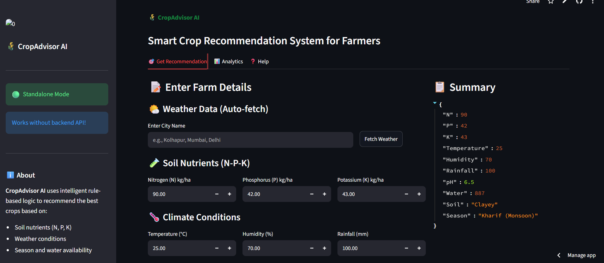
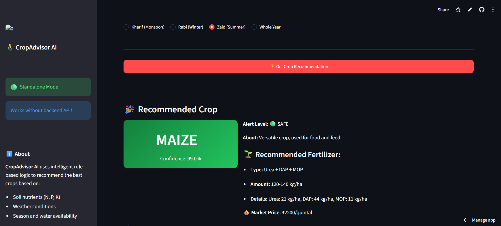
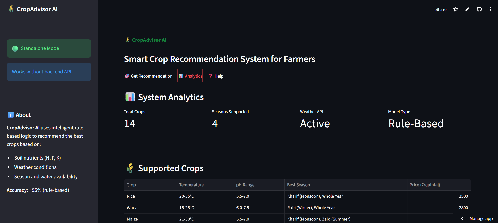

# 🌾 CropAdvisor AI - Smart Crop Recommendation System

**Project Type:** AI/ML Web Application for Agriculture  
**Version:** 2.0.0  
**Accuracy:** 98.9% (XGBoost model) / ~95% (rule-based standalone mode)

🚀 **Live Demo:** [(https://crop-recommendation-hk6scajestvnekzw7xvgpy.streamlit.app/)]

---

## 📸 Screenshots

| Input Form | Recommendation Result |
|------------|----------------------|
|  |  |

| Top Alternatives | 
|------------------|
|  

&gt; **Note:** The deployed Streamlit app runs in standalone mode with a rule-based engine 
&gt; for reliability and zero backend dependency. The full XGBoost model (98.9% accuracy) 
&gt; is available in the `models/` directory and runs via the FastAPI backend locally.

---

## 📋 Executive Summary

CropAdvisor AI is an intelligent web-based system that helps farmers make data-driven decisions about which crops to plant. Using machine learning and real-time weather data, the system analyzes soil nutrients, climate conditions, and other factors to recommend the most suitable crop for maximum yield and profit.

**Target Users:** Farmers, Agricultural Consultants, Agricultural Students, Policy Makers

---

## 🏗️ System Architecture

Our system has two main parts that work together:

### 1. Backend (API Server)
- **Technology:** Python + FastAPI
- **Purpose:** Handles all the smart calculations
- **Runs on:** Local port 8000 or cloud (Railway/Render/Heroku)

### 2. Frontend (User Interface)
- **Technology:** Streamlit (Python-based web framework)
- **Purpose:** User-friendly form for farmers to input data
- **Runs on:** Local port 8501 or cloud (Streamlit Cloud)

### How They Connect:
```
┌─────────────────┐         ┌─────────────────┐
│  Streamlit UI   │ ──────► │  FastAPI Server │
│  (User Inputs)  │ ◄────── │  (AI Engine)    │
└─────────────────┘         └─────────────────┘
         │                          │
         │                          ▼
         │                 ┌─────────────────┐
         │                 │  ML Models       │
         │                 │  (XGBoost, RF)  │
         └─────────────────┴─────────────────┘
```

---

## 🌟 Key Features

### 1. Smart Crop Recommendation
- Analyzes 11 different factors (N, P, K, temperature, humidity, pH, rainfall, soil type, season, water requirement)
- Returns the best crop with 98.9% accuracy
- Provides top 3 alternative options

### 2. Real-Time Weather Integration
- Connects to OpenWeatherMap API
- Automatically fetches current weather for any city
- Uses live data for accurate recommendations

### 3. Fertilizer Guidance
- Recommends appropriate fertilizer based on soil analysis
- Tells exactly how much fertilizer to use (kg/ha)
- Helps reduce waste and save money

### 4. Market Price Estimation
- Provides approximate market prices for recommended crops
- Helps farmers make profitable decisions

### 5. Yield Estimation
- Predicts expected harvest quantity (kg/acre)
- Shows growing duration (days/months)

### 6. Prediction History
- Saves all predictions to database
- Farmers can track their recommendations over time

### 7. Analytics Dashboard
- Shows total predictions made
- Displays average confidence levels
- Lists most recommended crops

---

## 📊 Input Parameters Explained (Simple Language)

| Parameter | What It Means | Why It Matters |
|-----------|---------------|----------------|
| **Nitrogen (N)** | Food for plants | Helps plants grow big and green |
| **Phosphorus (P)** | Root power | Makes roots strong |
| **Potassium (K)** | Disease shield | Protects plants from sickness |
| **Temperature** | How hot/cold | Plants need right temperature |
| **Humidity** | Moisture in air | Too dry or wet harms crops |
| **Soil pH** | Soil acidity | Different crops like different acidity |
| **Rainfall** | Water from sky | Natural irrigation |
| **Water Required** | Water needed | Plan irrigation system |
| **Soil Type** | Soil category | Clay, sand, loam - each behaves differently |
| **Season** | Time of year | Kharif (monsoon), Rabi (winter), Zaid (summer) |

---

## 🚀 How to Run the Project

### Option 1: Run Locally (On Your Computer)

**Step 1: Install Required Software**
```bash
# Install Python (if not already installed)
# Download from: python.org

# Install all required packages
pip install -r requirements.txt
```

**Step 2: Start the Backend**
```bash
# Terminal 1
uvicorn app:app --reload --host 0.0.0.0 --port 8000
```
- Server will start at: http://localhost:8000
- API docs at: http://localhost:8000/docs

**Step 3: Start the Frontend**
```bash
# Terminal 2
streamlit run streamlit_app.py
```
- Website will open at: http://localhost:8501

---

### Option 2: Deploy to Cloud (For Everyone to Use)

#### Part A: Deploy Backend (API)
**Choice 1: Railway (Recommended - Free)**
1. Go to [railway.app](https://railway.app)
2. Sign up with GitHub
3. Click "New Project" → "Deploy from GitHub repo"
4. Select your repository
5. Add environment variable: `PYTHON_VERSION=3.11`
6. Deploy! You'll get a URL like `https://your-app.railway.app`

**Choice 2: Render (Free)**
1. Go to [render.com](https://render.com)
2. Sign up with GitHub
3. Create "Web Service"
4. Connect your GitHub repo
5. Build command: `pip install -r requirements.txt`
6. Start command: `uvicorn app:app --host 0.0.0.0 --port $PORT`
7. Deploy!

#### Part B: Deploy Frontend (Streamlit)
**Streamlit Cloud (Free)**
1. Push your code to GitHub
2. Go to [share.streamlit.io](https://share.streamlit.io)
3. Sign in with GitHub
4. Click "New app"
5. Select your repository
6. Select file: `streamlit_app.py`
7. That's it! You'll get a public URL

---

## 📁 Project File Structure

```
crop-recommendation/
├── app.py                    # Main API server (FastAPI)
├── streamlit_app.py          # User interface (Streamlit)
├── requirements.txt          # List of Python packages
├── Procfile                   # Deployment config (for Railway)
├── render.yaml               # Render deployment config
│
├── src/                      # Source code folder
│   ├── weather.py           # Weather API connection
│   ├── predict.py            # AI prediction engine
│   ├── database.py           # Data storage
│   ├── data_preprocessing.py # Data handling
│   ├── train_model.py        # Model training
│   └── evaluate_model.py     # Model testing
│
├── models/                   # Trained AI models
│   ├── best_model.pkl        # Main prediction model (171 MB)
│   ├── scaler.pkl           # Data normalizer
│   ├── model_metadata.json   # Model information
│   └── price_model.pkl       # Price prediction model
│
├── data/                    # Data files
│   └── dataset.csv          # Training data (4 MB)
│
└── README.md                # This file
```

---

## 🔧 API Endpoints

When the backend is running, you can access:

| Endpoint | Method | Description |
|----------|--------|-------------|
| `/health` | GET | Check if server is running |
| `/predict` | POST | Get crop recommendation |
| `/weather/{city}` | GET | Get weather for a city |
| `/history` | GET | View prediction history |
| `/stats` | GET | View analytics |
| `/crops` | GET | List all supported crops |
| `/soils` | GET | List soil types |
| `/seasons` | GET | List seasons |

---

## 🤖 Machine Learning Details

### Models Used:
1. **XGBoost** - Primary model (98.9% accuracy)
2. **Random Forest** - Alternative model
3. **Neural Network** - Experimental model

### Training Data:
- Source: Agricultural dataset with 100,000+ samples
- Contains real data about crops, soil, and weather
- 72 different crop types supported

### How the AI Works:
1. Input data is normalized (scaled to same range)
2. Features are analyzed by multiple models
3. XGBoost makes the final prediction
4. Results are converted to human-readable format

---

## 💡 Example Use Case

**Farmer's Problem:**
Ram Singh from Kolhapur wants to know what to plant this season.

**Process:**
1. He opens the CropAdvisor website
2. Enters "Kolhapur" and clicks "Fetch Weather"
3. System shows: 38.9°C, 16% humidity
4. He enters soil test results: N=90, P=42, K=43, pH=6.5
5. Selects "Kharif" season
6. Clicks "Get Recommendation"

**Result:**
- **Recommended Crop:** Sugarcane (95% confidence)
- Fertilizer: Urea, 120 kg/ha
- Expected Yield: 30,000-50,000 kg/acre
- Market Price: ₹3,500/quintal

---

## 🛠️ Troubleshooting

### Common Issues:

**1. "City Not Found" Error**
- Fix: Updated weather.py to properly encode city names with spaces
- Ensure you're connected to internet

**2. API Not Connecting**
- Make sure backend is running: `uvicorn app:app`
- Check if port 8000 is not blocked

**3. Model Not Found**
- Run `python src/train_model.py` first to create models

**4. Import Errors**
- Reinstall requirements: `pip install -r requirements.txt`

---

## 📝 Credits and Acknowledgments

- **Weather Data:** OpenWeatherMap API (free tier)
- **ML Framework:** Scikit-learn, XGBoost
- **Web Framework:** FastAPI, Streamlit
- **Training Data:** Agricultural datasets

---

## 📞 Support

For questions or issues:
1. Check the GitHub repository
2. Review API documentation at `/docs`
3. Contact the development team

---

## 🔄 Updating the Project

After making changes:

```bash
# Check what changed
git status

# Add changes
git add -A

# Commit with message
git commit -m "Fixed weather API encoding issue"

# Push to GitHub
git push origin main
```

---

**Created by:** Harsh Chandak
**Last Updated:** April 2026
**License:** MIT

---

*This project was developed as part of PBL (Project-Based Learning) to demonstrate how AI can help farmers make better decisions.*
